# Vendor Onboarding Tracker

- Internal tool giúp Operations theo dõi onboarding vendor thay cho spreadsheet.

## Vấn đề cần giải quyết

- Vendor có thể ở một stage quá lâu mà không ai phát hiện.
- Nhiều coordinator cùng sửa spreadsheet có thể ghi đè hoặc làm sai dữ liệu.
- Spreadsheet khó xác định ai đã đổi stage, đổi lúc nào và đổi từ đâu sang đâu.

## Chạy ứng dụng

- Xem [hướng dẫn chạy bằng Docker](./RUNNING.md).

## Chức năng

- Đăng nhập bằng tài khoản mẫu: Linh, Huy hoặc Mai.
- Xem danh sách vendor cùng stage, region và coordinator cập nhật gần nhất.
- Cập nhật stage, ghi chú và xem lịch sử thay đổi.
- Xem số ngày vendor đã ở stage và số ngày vượt ngưỡng.
- Xem/chỉnh ngưỡng `Overdue` từ 1–365 ngày ngay trên dashboard; danh sách cập nhật lại sau khi lưu.

## Kỹ thuật

- Frontend: React, MUI, Zustand và Axios.
- Backend: NestJS, TypeORM, PostgreSQL và Redis.
- Cập nhật vendor và history trong cùng một transaction.
- `version` và Redis lock ngăn cập nhật cùng lúc làm ghi đè dữ liệu.

## Giới hạn

- Coordinator được chuyển vendor đến mọi stage.
- `Active` là stage cuối và không có `Overdue`.
- Authentication dùng mock session; vendor được tạo bằng seed data.
- Chưa có tạo/xóa vendor và tích hợp KYC/activation.

## Hướng phát triển

- Thêm SSO/RBAC.
- Dùng WebSocket để cập nhật realtime nếu internal tool có ít người dùng.
- Tách read/write bằng event-driven: PostgreSQL lưu dữ liệu gốc, Event Bus cập nhật NoSQL read model cho dashboard, notification và analytics, giúp giảm tải truy vấn.
- Tách KYC thành luồng `KYC Service → KYC Queue → OCR / Scan / Verification Workers`; queue giúp xử lý bất đồng bộ, retry khi lỗi và tránh quá tải. Tài liệu lưu trong Object Storage, kết quả lưu trong KYC Database.

## Sơ đồ

### Kiến trúc hiện tại

### Kiến trúc event-driven trong tương lai

### Database ERD

